# Super Gluu User Guide
## Splash screen

## Confirm Push Notification

During first loading Super Gluu will ask to confirm receiving push notifications from Gluu server. If you don't approve, you can do it in Settings of device. About Push Notification please see below.

## License agreement

To continue work with application you should accept license. You can scroll down to read all text of Super Gluu EULA. If you accept license then next time EULA text should not be visible.

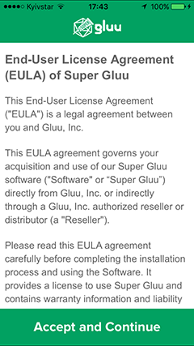

## Pin Code protection

To protect access to Super Gluu you can also configure Pin code. If click YES button next screen will provide you possibility to enter Pin code, this Pin code you should use for access each time when application runs. If click NO button, means you skip Pin code protection, but you can configure Pin code in Settings menu directly in application.

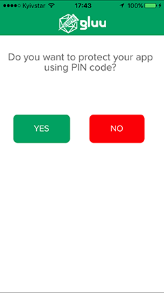

## Application tabs

When app is loaded and you finish setup all configuration you will see main screen. On center you can see welcome label and "Scan QR code" button. On top gluu logo, on bottom tab buttons: Home, Logs, Keys, Settings.

Home - main screen.
Logs - screen shows all logs durring enrol/authentication process.
Keys - contains all available keys saved on device, key it's unique file which app is using for authentication device on server side.
Settings - screen where you can configure Pin code access, reset current Pin and setup count of failed attempts Pin code.

### Home

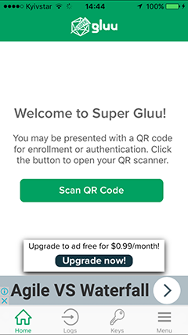

#### QR Code Enrollemnt

To enroll your device you should enter your credentials in web page of Gluu server and see QR code, after that click Scan QR code button on Home screen of application:

If scanning process completed and server returned correct request you will see Approve/Deny screen where are information about request and two buttons Approve & Deny. To continue enrol/authentication process please click Approve button, if you want to cancel click Deny:

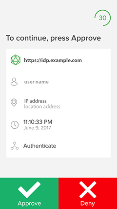

You may noticed timer on top-right side of screen, this timer shows you how much time you have to do decision Approve or Deny. If seconds = 20 timer will be in yellow, when seconds = 10 in red. You cannot to wait a lot.

If you make your decision Approve/Deny screen is removed and you returned to Home screen where you may see progress messages - success or not enrol/authentication.

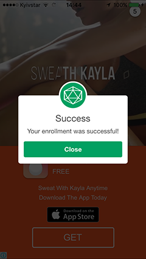

### Logs

Each time when you do enrol/authentication corresponding logs are saved into logs list and you can check it in Logs tab. Success enrol/authentication in green, failed in red. 

If there are some logs - button Clear is enabled and you can clear all logs clicked on this button.

If click Edit button then logs table will be editable and you can select any log(s) you want by click on check box on left. On bottom you can notice Select All button, you can use it to select all available logs.

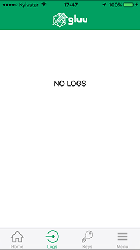 
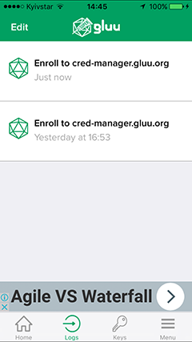 
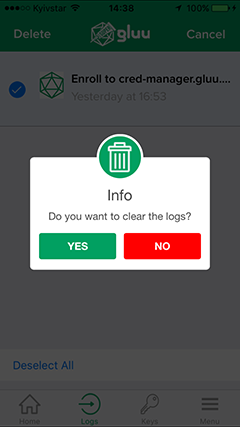
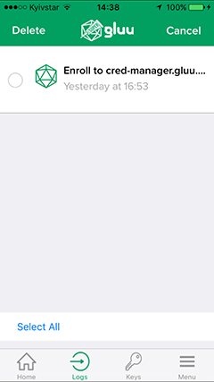

Also you can use swipe left to open options - View and Delete Log

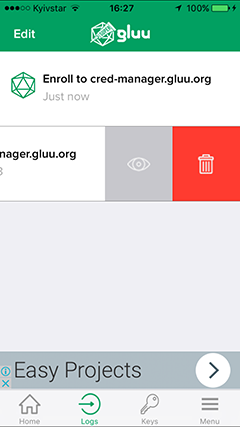

Log has information about enrol/authentication process and you can check where, when and who did login. If you click on button with arrow on right side of some logs new information view will be shown.

Information screen contains data about:

- Gluu server name & server url
- User name
- IP address & location
- Time & Date

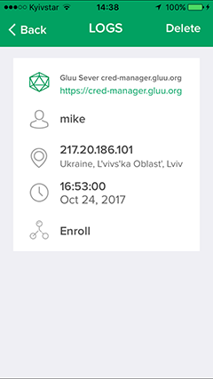

### Keys

This tab contains all available keys for each Gluu server. Key is unique file which is generated during enrol and application is using for authentication device on server side. If you delete key for some server then you should do enrol again with new key.

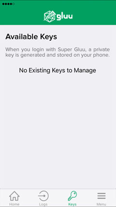   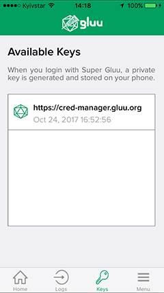

You can change key's name to new one, for this just hold on key for 3 seconds, after you will see message Do you want to change key's name? If approve you can enter new name, button "return" will save new name.

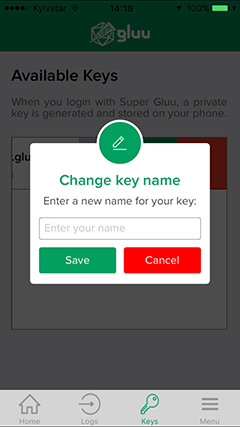

Also you can delete key from list. For this you have two ways:

1) Swipe to left on some key, delete button will appear on right side of key row, click on this button in confirm dialog press Yes.

2) Click on key, new information screen will appears, on top right click button Delete in confirm dialog press Yes.

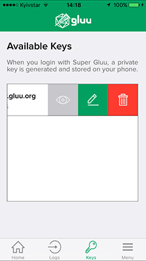

To see information about key just tap on key and new information dialog will be shown. On this screen you can see all information about key and using button "Delete" remove key from device.

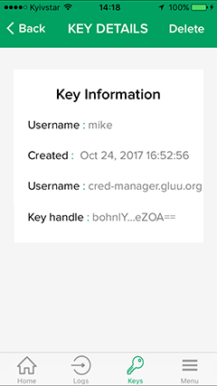

### Settings

In Settings you can configure Pin code and count of failed attempts entering Pin code.
If during first load application you didn't setup Pin code you can do it in this screen, what you need just turn on Pin protection. You can setup new Pin code or change current. If you set up totally new Pin code you can select type of Pin code - simple 4-digit Pin or custom.

You can change count of failed attempts entering Pin code, range is 5-10 attempts. If you enter wrong Pin code the same times as this count application will be locked for next 10 minutes and you should wait to have possibility enter Pin code again.

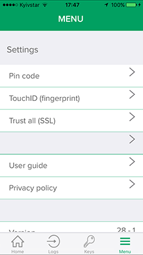

## Push Notifications

Super Gluu can receive push notifications from Gluu servers. Server sends to application enrol/authentication request the same as you get by scanning QR code directly in app. 

To order have possibility receive push notification you should approve receiving push in settings of application during first start or in Settings of device. Second step is enrol on server, during enrol application sends to server token of device, this token will be saved on server side and be used for sending push notification to device with this token.

If you recieved push notification you can make decision Approve or Deny directly from push menu. You have two options:

1) In case device in locked - swipe to left on push notification, you will see push menu with two buttons "Approve" and "Deny".

2) In case device isn't locked - swipe down on push notification, you will see push menu with two buttons "Approve" and "Deny".

3) If you click on push notification - application will open and you may see standard screen Approve/Deny with information and buttons.

Also Super Gluu can receive notification when application is opened and running in foreground mode. In that case you will see push view on top of main screen. This view contains text with request to server and two buttons Approve/Deny. You can make your decision directly on this view. If click Approve or Deny corresponding process will be launched.

## Landscape mode & Settings & iPad support

Super gluu can work in landscape mode, you just need rotate you device and see effect. If in landscape mode some components are hidden you can scroll up/down to see them.

 
 
 

If you go to Settings of device in the bottom you may find Super Gluu aplication, there is few settings for application - push notifications, location, access to camera, pin code protection. If you want you can change configuration, but be sure it's ok for you because any change will change bevavior of application.

You can run Super Gluu on iPad devices, layout should be the same for all IOS devices.
For more information please see the [Gluu Website](http://gluu.org)
